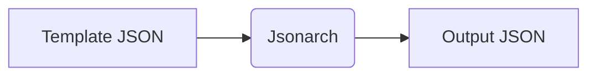
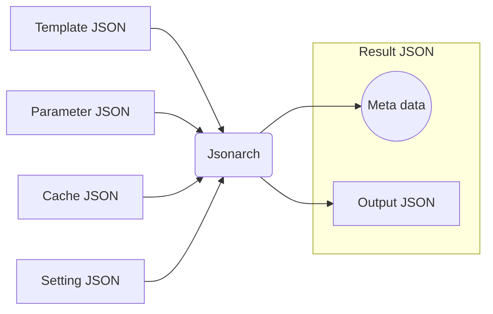

# Jsonarch

> [!WARNING]
> **This software is currently under development.**

Jsonarch is JSON to JSON processor for JavaScript/TypeScript, Commandline.

Requires: [Node.js](https://nodejs.org/)

## Feature

- Secure meta programmable JSON
- Profiler ( systerm, code, data )
- Origin map ( code, data )
- Influence map ( code, data )
- Call graph ( code )

## Overview

Minimum processing flow



Maximum processing flow



|File|Description|
|---|---|
|[Template JSON](./document/reference.md#template-json)|Code.|
|[Parameter JSON](./document/reference.md#parameter-json)|Data ( optional ).|
|[Cache JSON](./document/reference.md#cache-json)|Cache ( optional ).|
|[Setting JSON](./document/reference.md#setting-json)|Settings ( optional ).|
|[Result JSON](./document/reference.md#result-json)|Output JSON with meta data( profile result, origin map, influence map, call graph, etc ).|
|[Output JSON](./document/reference.md#output-json)|Generated JSON.|

See [Jsonarch Reference](./document/reference.md) for details.

## How to install for command

```sh
npm install jsonarch -g
```

## How to use Jsonarch as command

You need to run this command with administrator privileges.

```sh
jsonarch template.json -p parameter.json -c cache.json -s setting.json -r result.json -o output.json
```

See [Jsonarch Commandline Tool Reference](./document/commandline.md) for details.

## How to install as npm package

```sh
npm install jsonarch --save
```

## How to use Jsonarch as npm package

```ts
import { Jsonarch } from "jsonarch";

Jsonarch.process();
```

See [Jsonarch Module Reference](./document/module.md) for details.

## How to build

Requires: [Node.js](https://nodejs.org/), [TypeScript Compiler](https://www.npmjs.com/package/typescript)

`tsc -P ./source` or `tsc -P ./source -w`

## JSON Schemas

- [Template JSON Schema](./json-schema/template-json-schema.json)
- [Setting JSON Schema](./json-schema/setting-json-schema.json)

## Samples

- [Jsonarch Samples](./sample/index.md)

## References

- [Jsonarch Reference](./document/reference.md)
- [Jsonarch Module Reference](./document/module.md)
- [Jsonarch Commandline Tool Reference](./document/commandline.md)
- [Jsonarch Schema Reference](./document/schema.md)

## License

- [Boost Software License](LICENSE_1_0.txt)
